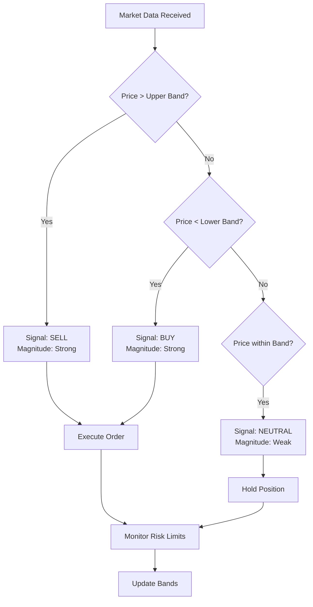
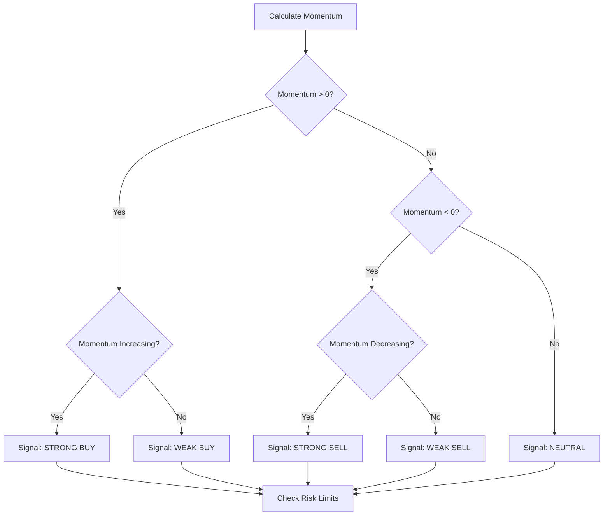
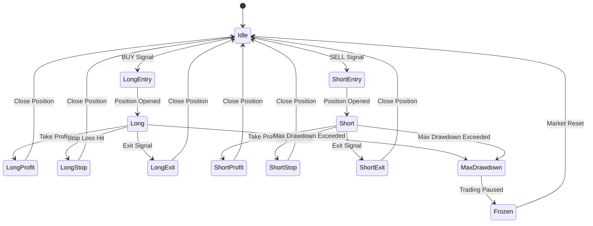
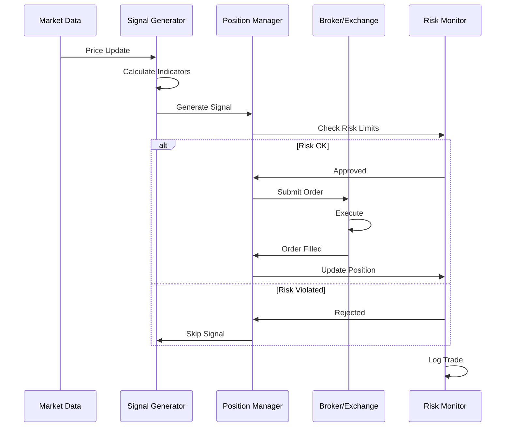

# Trading Algorithm Specification

This document describes the algorithmic trading strategies using visual diagrams, pseudocode, mathematical formulations, and parameter specifications.

---

## 1. Mean Reversion Strategy

### Decision Flow



### Algorithm Pseudocode

```
function MeanReversion(prices, period=20, std_dev_mult=2.0):
    
    // Calculate Bollinger Bands
    sma = SimpleMovingAverage(prices, period)
    std = StandardDeviation(prices, period)
    upper_band = sma + (std_dev_mult × std)
    lower_band = sma - (std_dev_mult × std)
    
    current_price = prices[latest]
    
    IF current_price > upper_band:
        signal = SELL
        strength = (current_price - upper_band) / (upper_band - lower_band)
    ELSE IF current_price < lower_band:
        signal = BUY
        strength = (lower_band - current_price) / (upper_band - lower_band)
    ELSE:
        signal = NEUTRAL
        strength = (current_price - lower_band) / (upper_band - lower_band)
    END IF
    
    // Position Sizing
    position_size = base_allocation × strength
    
    RETURN {signal, strength, position_size}
```

### Mathematical Definition

The mean reversion signal is calculated as:

$$\text{Signal Strength} = \frac{|P_t - \mu_t|}{\sigma_t \times k}$$

Where:
- $P_t$ = Current price at time $t$
- $\mu_t$ = Simple moving average (SMA) over period $n$
- $\sigma_t$ = Standard deviation over period $n$
- $k$ = Number of standard deviations (typically 2.0)

**Entry Conditions:**
- **Buy**: $P_t < \mu_t - k\sigma_t$
- **Sell**: $P_t > \mu_t + k\sigma_t$

### Rules & Parameters

| Parameter | Value | Description |
|-----------|-------|-------------|
| **Lookback Period** | 20 | Days for SMA and std dev calculation |
| **Std Dev Multiplier** | 2.0 | Number of std devs for band width |
| **Position Size** | 1.0 | Full allocation (100% of capital) |
| **Max Drawdown** | 5% | Stop trading if exceeded |
| **Min Separation** | 2 bars | Minimum bars between signals |
| **Risk/Reward Ratio** | 1:2 | Stop loss to take profit ratio |

---

## 2. Momentum Strategy

### Decision Flow



### Algorithm Pseudocode

```
function MomentumStrategy(prices, lookback=20, acceleration=0.2):
    
    // Calculate momentum
    momentum = prices[latest] - prices[latest - lookback]
    prev_momentum = prices[latest - 1] - prices[latest - 1 - lookback]
    momentum_accel = momentum - prev_momentum
    
    // Threshold for acceleration
    acceleration_threshold = STDEV(momentum) × acceleration
    
    IF momentum > 0 AND momentum_accel > acceleration_threshold:
        signal = STRONG_BUY
        confidence = (momentum / MEAN(momentum)) × (momentum_accel / acceleration_threshold)
    ELSE IF momentum > 0:
        signal = BUY
        confidence = momentum / MEAN(momentum)
    ELSE IF momentum < 0 AND momentum_accel < -acceleration_threshold:
        signal = STRONG_SELL
        confidence = ABS(momentum / MEAN(momentum)) × ABS(momentum_accel / acceleration_threshold)
    ELSE IF momentum < 0:
        signal = SELL
        confidence = ABS(momentum / MEAN(momentum))
    ELSE:
        signal = NEUTRAL
        confidence = 0.0
    END IF
    
    // Adjust position size by confidence
    position_size = base_allocation × confidence
    
    RETURN {signal, confidence, position_size}
```

### Mathematical Definition

Momentum at time $t$ is defined as:

$$M_t = P_t - P_{t-n}$$

Momentum acceleration (rate of change of momentum):

$$A_t = M_t - M_{t-1} = (P_t - P_{t-n}) - (P_{t-1} - P_{t-n-1})$$

Signal strength is normalized by volatility:

$$S_t = \frac{M_t}{\mu(M) \times \sigma(M)}$$

### Rules & Parameters

| Parameter | Value | Description |
|-----------|-------|-------------|
| **Lookback Period** | 20 | Days for momentum calculation |
| **Acceleration Threshold** | 0.2 | Multiplier of momentum std dev |
| **Base Allocation** | 0.5 | 50% of capital per signal |
| **Rebalance Frequency** | Daily | Update signals daily |
| **Min Signal Confidence** | 0.3 | Minimum confidence to trade |
| **Max Concurrent Positions** | 5 | Maximum open positions |

---

## 3. Portfolio State Machine



---

## 4. Risk Management Parameters

| Category | Parameter | Value | Purpose |
|----------|-----------|-------|---------|
| **Position** | Max Size | 1.0 (100%) | Prevent over-concentration |
| **Position** | Min Entry | 0.1 (10%) | Minimum position size |
| **Loss** | Stop Loss | -2% | Hard stop on individual trades |
| **Loss** | Max Drawdown | -5% | Pause trading if portfolio drawdown |
| **Profit** | Take Profit | +4% | Auto close winners |
| **Time** | Max Hold | 20 days | Close if not profitable |
| **Correlation** | Min Diversification | 0.5 | Keep assets uncorrelated |
| **Leverage** | Max Leverage | 1.0x | No leverage trading |

---

## 5. Execution Workflow



---

## 6. Performance Metrics

### Key Performance Indicators (KPIs)

| Metric | Target | Formula |
|--------|--------|---------|
| **Sharpe Ratio** | > 1.5 | $\frac{R_p - R_f}{\sigma_p}$ |
| **Sortino Ratio** | > 2.0 | $\frac{R_p - R_f}{\sigma_d}$ |
| **Max Drawdown** | < -10% | $\frac{\text{Trough} - \text{Peak}}{\text{Peak}}$ |
| **Win Rate** | > 50% | $\frac{\text{Winning Trades}}{\text{Total Trades}}$ |
| **Profit Factor** | > 1.5 | $\frac{\text{Gross Profit}}{\text{Gross Loss}}$ |
| **CAGR** | > 15% | $\left(\frac{\text{End Value}}{\text{Start Value}}\right)^{1/n} - 1$ |

---

## 7. Implementation Notes

- All strategies use adaptive parameters based on market regime
- Indicators are recalculated on each new bar
- Positions are evaluated against risk limits before execution
- All trades are logged for performance analysis
- Strategies can be combined using weighted ensemble approach

---

## References

- Mean Reversion: Bollinger Bands (John Bollinger, 1980s)
- Momentum: Technical Analysis from A to Z (Steven Piotroski)
- Position Sizing: Risk Management and Money Management (Ralph Vince)
- Modern Portfolio Theory: Markowitz, 1952
